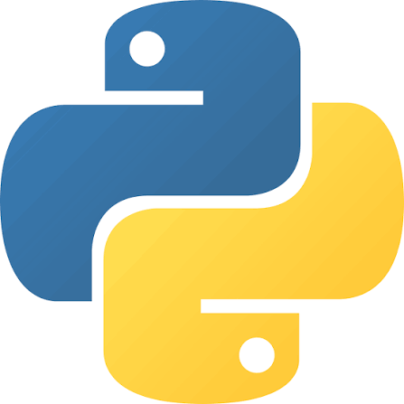

# Pagina Web del Centro

## INDICE
- [1.Instalacion](#instalacion)
- [2.Frontend](#frontend)
- [3.Backend](#backend)
## INSTALACION

Se requiere la instalacion y el uso de los lenguajes [PHP][1] y [PYTHON][2]  
**Accede al los links proporcionados ya que son los oficiales** 

  
  

[1]: (https://www.php.net/)
[2]: (https://www.python.org/)
## Intranet de Gestion Docente

| Sistemas Que se crearan | Funcion |
| --- | --- |
| Ronda por hueco horario | Contador de guardias |
| Sorteo al iniciar cada ronda | La selección entre docentes en igualdad de condiciones es aleatoria. |
| Sustitución con reequilibrio | Si el asignado (ej. 3 guardias) no puede, la cubre otro |

## Arquitecturas tecnicas de la intranet

***DIAGRAMA DE CAPAS :***
>Clientes(PWA)
>>Escritorio + móvil · Service Worker 

>API Gateway -- Fast Api
>>/api/v1 · JWT + roles (Depends) · Swagger /doc

>Módulos de Negocio
>>Académico · Guardias/firma · Tickets · Admin/seguridad
